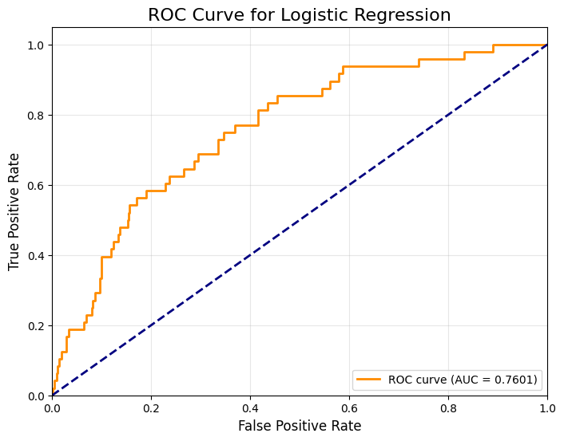

# Lung Cancer Diagnosis Project

# 📌 Overview

This project aims to diagnose lung cancer based on various patient informations including clinical and lifestyle features. The dataset is processed, engineered, and used to train multiple machine learning models to optimize diagnostic performance.

# 📊 Dataset

Source: phenotype.txt

Target Variable: LUNG (Lung Cancer Presence)

**Note:** Due to **privacy concerns**, medical dataset itself **is not included** in this repository.

However, the following table describes the **key variables** used in this study.

| **Variable**   | **Description** |
|--------------|----------------------------|
| `AGE_B`      | Age at the time of screening (years) |
| `SEX1`       | Gender (1: Male, 2: Female) |
| `SMOK_B`     | Smoking status (1: Non-smoker, 2: Former smoker, 3: Current smoker) |
| `SMOKA_MOD_B` | Average number of cigarettes per day |
| `ALCO_B`     | Alcohol consumption (1: Yes, 2: No) |
| `ALCO_AMOUNT_B` | Alcohol intake per session (in drinks) |
| `EXER_B`     | Regular exercise habit (1: Yes, 2: No) |
| `HT_B`       | Height (cm) |
| `WT_B`       | Weight (kg) |
| `WAIST_B`    | Waist circumference (cm) |
| `SBP_B`      | Systolic blood pressure (mmHg) |
| `DBP_B`      | Diastolic blood pressure (mmHg) |
| `CHO_B`      | Total cholesterol (mg/dL) |
| `LDL_B`      | Low-density lipoprotein cholesterol (mg/dL) |
| `TG_B`       | Triglycerides (mg/dL) |
| `HDL_B`      | High-density lipoprotein cholesterol (mg/dL) |
| `FBS_B`      | Fasting blood sugar (mg/dL) |
| `GOT_B`      | AST (IU/L) |
| `GPT_B`      | ALT (IU/L) |
| `GGT_B`      | r-GTP (IU/L) |
| `URIC_B`     | Uric acid (mg/dL) |
| `FEV1`       | Forced expiratory volume in 1 second (L) |
| `FVC`        | Forced vital capacity (L) |
| `BIL`        | Total bilirubin (mg/dL) |
| `WBC`        | White blood cell count (/μL) |
| `CREAT`      | Creatinine (mg/dL) |
| `PCAN80`     | Family history of lung cancer (1: Yes, 0: No) |
| `PCAN89`     | Family history of thyroid cancer (1: Yes, 0: No) |
| `FCAN80`     | Family history of lung cancer (1: Yes, 0: No) |
| `FCAN89`     | Family history of thyroid cancer (1: Yes, 0: No) |
| `LUNG`       | Lung cancer diagnosis (1: Yes, 0: No) |

# 🔹 Data Preprocessing

### 1️⃣ Handling Missing Values

Mean Imputation: SMOK_B, HT_B, WT_B, WAIST_B, SBP_B, DBP_B, CHO_B, LDL_B, TG_B, HDL_B, FBS_B, GOT_B, GPT_B, GGT_B, URIC_B, BIL, WBC, CREAT

Zero Imputation: PCAN80-89, FCAN80-89

Conditional Imputation for SMOKA_MOD_B based on SMOK_B level

### 2️⃣ Outlier Processing

IQR-based capping for WBC

# 🔹 Exploratory Data Analysis

Correlation Analysis between LUNG and other features

Chi-Square Test for categorical variables

# 🔹 Feature Engineering

New Variables Derived:

SMOK_INT = SMOK_B * SMOKA_MOD_B (Smoking Intensity)

ALCO_INT = ALCO_AMOUNT_B / ALCO_B (Alcohol Intensity)

BMI = WT_B / (HT_B/100)^2 (Body Mass Index)

FEV1_FVC = FEV1 / FVC (Degree of Airflow Obstruction)

Family History Score:

Selected PCAN80, PCAN89, FCAN80

Trained logistic regression to determine weights

Final Variable Definition: Cancer_History_Score = x*PCAN80 + y*PCAN89 + z*FCAN80

# 🔹 Model Training & Evaluation

### 1️⃣ Random Forest Classifier

AUC Score: 0.7849

Feature Importance: BMI, WBC, AGE_B, FEV1_FVC, ALCO_INT, SMOK_INT, Cancer_History_Score

### 2️⃣ Logistic Regression

AUC Score: 0.7601

### 3️⃣ Stacking Ensemble Model

Base Models: RandomForest, XGBoost, LightGBM, SVC

Final Estimator: Logistic Regression

AUC Score: 0.8068

### 4️⃣ Voting Classifier

Soft Voting with Base Models

AUC Score: 0.8088

### 5️⃣ K-Means Clustering (Experimental Approach)

AUC Score: 0.5929

# 🚀 Conclusion

Voting Classifiers achieved the best performance with an AUC score of ~0.81.

Feature engineering and preprocessing played a crucial role in performance improvement.

Further optimization and hyperparameter tuning could enhance results.

